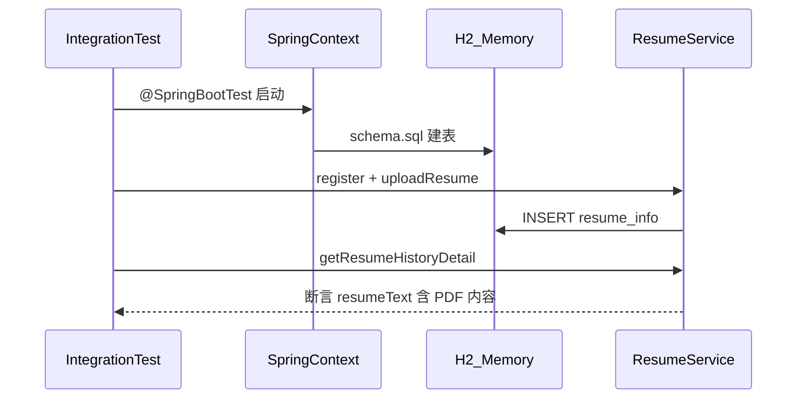

# 测试与质量保障方案

本文档是本项目**测试体系总纲**，说明在[单元测试](前端路由单元测试说明.md)之外，如何开展集成测试、可靠性度量、兼容性验证、代码审查、容错设计验证、性能测试与验收测试。适用于软件工程团队日常协作。

**相关文档：**

| 文档 | 内容 |
| --- | --- |
| [系统架构说明.md](系统架构说明.md) | 三端边界、端口、数据流 |
| [接口说明.md](接口说明.md) | 统一返回格式与 API 列表 |
| [前端路由单元测试说明.md](前端路由单元测试说明.md) | 前端 Vitest 路由单测 |
| [README.md](../README.md) | 环境要求、启动与测试命令 |

---

## Q1. 测试覆盖率

### 当前测试覆盖率概况（实测更新：2026-05-27）

仓库**尚未**在 CI 中设置覆盖率门禁；下表为本地**实测**结果（JaCoCo 0.8.12、Vitest `@vitest/coverage-v8` 2.1.8、`pytest-cov`）。日常 `mvn test` / `npm test` / `pytest` 仍可不跑覆盖率插件。

**说明：** 三端代码量差异大（前端 `views` 行数多），**不宜**对下表百分比做简单算术平均；全仓库行覆盖粗算约 **20%～30%**（以前端未测页面拉高分母为主）。

### 三端汇总

| 模块 | 自动化用例 | 度量命令 | 行覆盖（Lines/Stmts） | 指令/分支等 |
| --- | --- | --- | --- | --- |
| 后端 | 13 个测试类、**37** 条用例 | JaCoCo（见下文） | **45%**（831 / 1,847 行） | 指令 **44%**；分支 **25%**；方法 **49%**（277 / 569） |
| 前端 | 9 个测试文件、**36** 条用例 | `npm test -- --coverage` | **15.18%**（`src` 全量） | 分支 65.45%；函数 58.49% |
| ai-service | **12** 条用例 | `pytest tests --cov=app` | **100%**（65 / 65 语句） | 仅 `app` 包；代码规模小 |
| **全项目** | — | — | **粗算 20%～30%** | 见各端明细 |

### 后端 JaCoCo 明细

**报告：** `backend/target/site/jacoco/index.html`

| 指标 | 覆盖率 | 已覆盖 / 总计 |
| --- | --- | --- |
| 指令（Instructions） | **44%** | 3,329 / 7,497 |
| 分支（Branches） | **25%** | 142 / 556 |
| 行（Lines） | **45%** | 831 / 1,847 |
| 方法（Methods） | **49%** | 277 / 569 |
| 类（Classes） | **81%** 至少被触及 | 52 / 64（12 类无覆盖记录） |

**按包（指令 Instruction 覆盖）：**

| 包 | 覆盖率 | 备注 |
| --- | --- | --- |
| `exception` | **87%** | `GlobalExceptionHandler` 等 |
| `config` | **83%** | 含 `JobDataInitializer` |
| `service`（`PdfResumeDocumentParser`） | **82%** | PDF 解析 |
| `service.impl` | **37%** | 缺口最大：`ResumeServiceImpl`、`JobServiceImpl`、`AdminServiceImpl` |
| `controller` | **39%** | 7 个 Controller 均有切片测试；`AdminController` 写操作仍偏低 |
| `llm` | **38%** | `PrivacyTextSanitizer` 高；`DeepseekChatClient` 约 6% |
| `entity` | **63%** | 集成测写入实体 |
| `vo` | **59%** | 部分 VO 未被接口返回触及 |
| `dto` | **20%** | 多为 getter，参考价值有限 |

**已有效覆盖：** 全部 Controller 切片、脱敏、Advice Service（Mock）、PDF 解析、简历注册→上传→详情集成链路。

**仍偏低：** `DeepseekChatClient` HTTP、`ResumeServiceImpl` 匹配与上传分支、Admin 增删改与导入、`AnalysisServiceImpl` / `JobServiceImpl` 业务实现。

**复现（PowerShell，`backend` 目录）：**

```powershell
mvn org.jacoco:jacoco-maven-plugin:0.8.12:prepare-agent test org.jacoco:jacoco-maven-plugin:0.8.12:report
```

### 前端 Vitest 覆盖率明细

**命令：** `cd frontend && npm test -- --coverage`（依赖已加入 `devDependencies`：`@vitest/coverage-v8`）

| 目录 / 文件 | 行覆盖 | 说明 |
| --- | --- | --- |
| **`src/api/*`** | **100%** | `admin`、`analysis`、`auth`、`http`、`interest`、`job`、`resume` |
| **`src/stores/user.js`** | **100%**（语句） | 分支约 53%（`setUser` 默认值分支） |
| **`src/router/index.js`** | **94%** | 未覆盖 `beforeEach` 内改标题逻辑（约 83–87 行） |
| **`src/views/*.vue`** | **0%** | 9 个页面均未组件测试 |
| **`App.vue` / `main.js`** | **0%** | 入口未测 |
| **全项目 `src` 合计** | **15.18%** | 页面代码行数占主导 |

### ai-service pytest-cov 明细

**命令：**

```powershell
cd ai-service
.\.venv\Scripts\pip install -r requirements.txt pytest-cov
$env:PYTHONPATH = "."
.\.venv\Scripts\pytest tests --cov=app --cov-report=term
```

| 模块 | 语句覆盖 |
| --- | --- |
| `app/services/skill_extractor.py` | 100% |
| `app/services/match_service.py` | 100% |
| `app/services/resume_service.py` | 100% |
| `app/routers/*`（health、match、resume） | 100% |
| `app/main.py`、schemas | 100% |
| **TOTAL** | **100%**（65 语句，12 用例） |

说明：AI 服务代码量小且当前测试以规则逻辑为主，100% 不代表生产 LLM 场景；新增路由或异常分支后需重测。

### 与改进目标的关系

正文 P1/P2（Service 单测、Vue 组件测、JaCoCo/pytest 写入 CI）用于提升上表数字。课程报告建议引用：**本表实测 + 分模块未覆盖清单 + 目标阈值**（如后端行覆盖 ≥50%、前端 `src/api` 保持 100% 并逐步覆盖 `views`）。

## Q3. 集成测试方案

### 3.1 定义（本项目）

**集成测试：** 两个及以上真实模块协作，例如 Spring 容器 + H2 + Mapper/Service，或后端通过 HTTP 调用 AI 服务（真实或 Mock）。

与**单元测试**区别：单元测试 Mock 掉 Mapper/HTTP；集成测试使用真实 H2 与 Spring 注入。

与**验收测试**区别：集成测试自动化、场景较窄；验收覆盖端到端业务与人工判断。

### 3.2 类型与工具

| 类型 | 目标 | 工具 / 注解 | 示例 |
| --- | --- | --- | --- |
| 垂直集成 | Service + DB | `@SpringBootTest` | 注册 → `uploadResume` → `getResumeHistoryDetail` 含 PDF 文本 |
| API 集成 | Controller + Service + DB | `@SpringBootTest` + `@AutoConfigureMockMvc` | `POST /api/auth/login`、`POST /api/resume/upload` |
| 跨服务 | Backend ↔ AI | WireMock、或联调启动 8000 | 匹配分数回写（若走 HTTP 调 ai-service） |
| 前端集成 | 组件 + Mock API | Vitest、可选 MSW | 上传失败提示、列表渲染 |

**已有参考实现：** [`ResumeHistoryDetailIntegrationTest.java`](../backend/src/test/java/com/example/jobplatform/service/ResumeHistoryDetailIntegrationTest.java)

### 3.3 执行策略

| 时机 | 动作 |
| --- | --- |
| 每次提交 / PR | `mvn test`、`npm test`、`pytest`（ai-service 建议 `tests` 全量） |
| 合并前 | 代码审查 + 三命令全绿 |
| 发版 / 演示前 | 三端启动（5173 / 8080 / 8000）+ 第 8 节 UAT 清单抽样 |
| 不建议 | 在 CI 中调用真实 DeepSeek 或依赖外网配额 |

### 3.4 通过标准

- 所有自动化集成用例通过，无 `@Disabled` 遗留（除非注明原因）。
- 不依赖本机 `8080` 端口已占用（集成测不启 Tomcat 监听，或使用随机端口）。
- 测试数据隔离：内存库每套件独立，避免污染开发用 `./data/job_platform`。



---

## Q4. 可靠性指标

| 指标 | 定义 | 建议目标 | 采集方式 |
| --- | --- | --- | --- |
| 自动化测试通过率 | 通过用例数 / 总用例数 | 100% | `mvn test`、`npm test`、`pytest` 输出 |
| 构建成功率 | 最近一次完整测试是否成功 | 持续成功 | 本地日志；后续可接 GitHub Actions |
| 健康检查可用性 | 核心健康接口可访问 | 联调期接近 100% | 定时 `curl` `/api/health`、`/health` |
| 核心接口错误率 | 抽样请求中 `code != 200` 占比 | 联调环境 &lt; 1% | 后端日志 + Postman 集合统计 |
| MTTR | 从发现缺陷到修复并回归通过的时间 | 记录在缺陷单 | 项目管理表 / Issue |
| LLM 降级能力 | 无 `DEEPSEEK_API_KEY` 或调用失败时，非 LLM 功能可用 | 岗位列表、上传、历史可查 | 手工 UAT + `ServiceUnavailableException` 单测 |

**不强制：** MTBF、全年 99.99% 可用性等工业指标；重点在**测试门禁 + 可观测 + 文档化故障案例**。

**建议记录模板（实验报告）：**

```text
日期 | 版本/提交 | mvn test | npm test | pytest | 备注
```

---

## Q5. 兼容性处理

### 5.0 旧系统交互：不需要，目前项目结构较为简单，没有与外部的遗留系统进行对接。

### 5.1 运行环境

| 组件 | 要求 | 验证 |
| --- | --- | --- |
| JDK | 17+ | `java -version` |
| Maven | 3.8+ | `mvn -version` |
| Node.js | 18+ | `node -v` |
| Python | 3.10+ | `python --version` |

新成员按 [README 环境要求](../README.md) 自检后再启动三端。

### 5.2 浏览器（前端验收）

| 浏览器 | 验收方式 |
| --- | --- |
| Chrome / Edge | 主验收环境 |
| FireFox | 计划兼容 |
| 移动端 | 计划兼容 |

### 5.3 数据库兼容

| 环境 | 配置 | 用途 |
| --- | --- | --- |
| 开发 | H2 文件库 `./data/job_platform` | `spring-boot:run` |
| 测试 | H2 内存 `test_job_platform` | `mvn test` |
| 生产预留 | MySQL + `sql/schema-mysql.sql` | 切换后需执行脚本并冒烟 |

**注意：** 主配置 `spring.sql.init.mode` 与测试配置可能不同；改主配置时需确认 `src/test/resources/application.yml` 仍能建表。

### 5.4 API 与前端代理兼容

- **统一响应：** `{ "code", "message", "data" }`，见 [接口说明.md](接口说明.md)。新增字段应向后兼容，避免删除或改名已有字段。
- **端口变更：** 后端非 8080 时，同步修改 [`frontend/vite.config.js`](../frontend/vite.config.js) 中 `server.proxy['/api'].target`。
- **字符集：** 中文岗位、简历 PDF；`schema.sql` 使用 UTF-8，集成测试含中文断言。

### 5.5 兼容性验证清单（发版前）

- [ ] JDK / Node / Python 版本符合 README
- [ ] Chrome 下登录、岗位、简历主流程可走通
- [ ] `mvn test` 在干净克隆仓库上通过（仅 H2 测试库）

---

## Q6. 代码审查（Code Review）

### 6.1 流程

```text
开发完成 → 本地三端测试通过 → 提交 PR → 至少 1 人 Review → 合并
```

合并前**必须**满足：

```bash
cd backend && mvn test
cd frontend && npm test
cd ai-service && .venv/Scripts/pytest    # Windows
# 或: source .venv/bin/activate && pytest
```

### 6.2 审查清单

**业务与接口**

- [ ] 新/改接口符合 `ApiResponse` 约定，`code` 语义与 [接口说明](接口说明.md) 一致
- [ ] 异常经 [`GlobalExceptionHandler`](../backend/src/main/java/com/example/jobplatform/exception/GlobalExceptionHandler.java) 统一返回，无 Controller 内吞异常
- [ ] 分页、校验注解（`@Valid`、`@NotBlank`）完整

**安全与隐私**

- [ ] 发往 DeepSeek 的文本经 [`PrivacyTextSanitizer`](../backend/src/main/java/com/example/jobplatform/llm/PrivacyTextSanitizer.java) 处理
- [ ] 无 API Key、密码写入仓库；仅环境变量或本地未提交配置
- [ ] 上传文件类型与大小限制合理

**测试**

- [ ] 新分支有单测或集成测；修 bug 有回归用例
- [ ] 路由 `name` 变更时同步 [`index.test.js`](../frontend/src/router/index.test.js)
- [ ] `application.yml` 变更时检查 `src/test/resources`

**工程**

- [ ] 依赖版本合理，无调试输出、`console.log` 泛滥
- [ ] 命名与现有包结构一致（`controller` / `service` / `vo`）

### 6.3 角色分工（与 README 对应）

| 角色 | Review 侧重 |
| --- | --- |
| 前端 | Vue 组件、API 封装、路由、Axios 错误处理 |
| 后端 | 事务、SQL、异常码、DeepSeek 调用链 |
| AI 与测试 | ai-service 算法、pytest、联调清单 |
| 数据 | 表结构、导入脚本与统计接口一致性 |

---

## Q7. 容错性

### 7.1 设计要点（现有实现）

| 场景 | 机制 | HTTP 层 `code` |
| --- | --- | --- |
| 请求参数校验失败 | `MethodArgumentNotValidException` | 400 |
| 业务参数非法 | `IllegalArgumentException` | 400 |
| 未配置 DeepSeek Key 等服务不可用 | `ServiceUnavailableException` | 503 |
| DeepSeek HTTP / 网络 / 解析错误 | `DeepseekException` | 502 |
| 未捕获异常 | `Exception` → 统一文案 | 500 |

前端应判断 `response.data.code === 200`（而非仅 HTTP 200），与后端约定一致。

**超时：** [`DeepseekProperties`](../backend/src/main/java/com/example/jobplatform/config/DeepseekProperties.java) 配置 `connect-timeout`、`read-timeout`（如 120s），避免无限阻塞。

**岗位匹配：** 当前后端 [`ResumeServiceImpl`](../backend/src/main/java/com/example/jobplatform/service/impl/ResumeServiceImpl.java) 以 Java 规则评分为主；`ai-service.base-url` 预留给后续对接。联调时 ai-service 停止不应阻塞仅依赖后端的列表与上传（匹配若改为依赖 8000，需在 UI 给出明确错误提示）。

### 7.2 验证方法

| 场景 | 自动化 | 手工 |
| --- | --- | --- |
| 400 / 502 / 503 / 500 | `GlobalExceptionHandlerTest`、Controller 切片 | — |
| 无 DeepSeek Key | `JobSelectionAdviceServiceImplTest` | UAT-06 |
| ai-service 停机 | Mock HTTP 5xx（待补集成测） | 停止 8000 后点匹配相关功能 |
| 空库启动失败 | `schema.sql` + `init.mode: always` | 删 `backend/data` 后重启 |
| 非 PDF / 超大文件 | 待补单测/集成 | 上传 .txt / 大文件 |

### 7.3 可选增强（文档建议，非已实现）

- 前端 Axios 统一拦截：`code !== 200` 时 `ElMessage.error(message)`
- DeepSeek 失败重试上限（避免风暴）
- 健康检查聚合三端状态（管理页展示）

---

## Q8. 性能测试

### 8.1 范围

不做大规模全链路压测；对**关键路径**做抽样基准。

### 8.2 场景与参考阈值

| 场景 | 接口 | 工具建议 | 指标 | 参考阈值（联调机、小数据） |
| --- | --- | --- | --- | --- |
| 岗位列表 | `GET /api/job/list` | k6、JMeter、ab | P95 响应时间 | &lt; 500 ms |
| 简历上传 | `POST /api/resume/upload` | 同上 | 单次耗时 | &lt; 3 s（&lt; 2 MB PDF） |
| AI 规则匹配 | `POST /ai/job/match` | k6 | P95 | &lt; 1 s |
| DeepSeek 建议 | `POST /api/resume/{id}/job-selection-advice` | 浏览器开发者工具 / Postman | 端到端 | &lt; 120 s（与 read-timeout 一致） |

### 8.3 执行步骤模板

1. **记录环境：** CPU、内存、JDK 版本、数据量（岗位条数）。
2. **准备脚本：** 固定并发用户数（如 10）、持续时间（如 30s）。
3. **执行 3 轮，** 取 P95 中位数。
4. **填表：** 场景 | 并发 | P50 | P95 | 错误率 | 是否达标。
5. **与功能测试分离；** 不对 DeepSeek 做高并发压测。

### 8.4 示例（curl 粗测延迟）

```bash
# 需先启动后端
curl -w "time_total=%{time_total}\n" -o /dev/null -s http://localhost:8080/api/job/list
```

---

## Q9. 验收测试（UAT）

### 9.1 角色与依据

- **执行人：** 产品/教师验收方、测试负责人、开发自测。
- **依据：** [README 当前能做什么](../README.md)、[接口说明.md](接口说明.md)、简历流程 [2026-05-07-resume-history-flow.md](superpowers/plans/2026-05-07-resume-history-flow.md)。

### 9.2 通过标准

- **P0 用例**（下表标记）100% 通过。
- **P1 用例** ≥ 90% 通过，未通过项记入缺陷单并说明计划。
- 已知模拟数据、未接 MySQL 的项在报告中**明确声明**，不记为阻塞缺陷。

### 9.3 验收用例表

| ID | 优先级 | 场景 | 前置条件 | 步骤摘要 | 预期结果 |
| --- | --- | --- | --- | --- | --- |
| UAT-01 | P0 | 用户注册 | 三端已启动 | 注册页填写手机号/密码 → 提交 | `code=200`，可登录 |
| UAT-02 | P0 | 用户登录 | 已注册 | 登录页输入账号密码 | 进入首页看板 |
| UAT-03 | P0 | 三端健康 | 三端已启动 | 访问 `/api/health`、`/health`、前端首页 | 后端/AI 为 UP，前端可打开 |
| UAT-04 | P0 | 岗位列表 | 已登录 | 打开岗位列表 | 有数据，可点进详情 |
| UAT-05 | P0 | 岗位详情 | 有岗位数据 | 从列表进入详情 | 字段展示完整 |
| UAT-06 | P0 | 简历上传 | 已登录 | 简历页上传 PDF | 成功提示，历史列表可见 |
| UAT-07 | P0 | 简历详情 | 已上传 | 打开历史 → 详情 | 解析文本非空 |
| UAT-08 | P0 | 岗位匹配 | 已上传简历 | 触发匹配 | 返回分数/排行合理 |
| UAT-09 | P1 | 数据分析 | 已登录 | 打开分析页 | 图表有数据或空态友好 |
| UAT-10 | P1 | 后台管理 | 已登录 | 打开管理页 | 看板数字展示 |
| UAT-11 | P1 | DeepSeek 岗位建议 | 已配置 `DEEPSEEK_API_KEY` | 详情页生成岗位建议 | 建议展示且刷新后仍在 |
| UAT-12 | P1 | 兴趣岗位简历建议 | 已配置 Key + 兴趣岗位 | 生成兴趣简历建议 | 建议展示 |
| UAT-13 | P0 | 无 Key 降级 | 未配置 Key | 点击 DeepSeek 建议按钮 | `code=503` 或友好提示，其他功能正常 |
| UAT-14 | P1 | 登出/再次登录 | — | 退出后重新登录 | 会话与页面正常 |
| UAT-15 | P1 | 中文内容 | 含中文 PDF | 上传并查看详情 | 无乱码 |
| UAT-16 | P2 | 端口冲突恢复 | 8080 被占用 | 改端口或释放后重启 | 后端可启动 |
| UAT-17 | P2 | AI 服务停止 | 仅停 8000 | 使用仅后端功能 | 核心 CRUD 仍可用；依赖 AI 的功能有提示 |
| UAT-18 | P2 | 浏览器兼容 | Chrome + Firefox | 走 UAT-01～08 | 无阻塞性 UI 错误 |

### 9.4 交付物

| 交付物 | 说明 |
| --- | --- |
| 验收记录表 | 用例 ID、通过/失败、执行人、日期 |
| 缺陷列表 | 编号、严重程度、复现步骤、状态 |
| 回归记录 | 修复后 `mvn test` / `npm test` / `pytest` 截图或日志 |
| 签字确认 | 教师/组长签字（可 PDF 扫描） |

## Q10. 测试文档准备方法

### 10.1 交付的文档清单

| 序号 | 文档名称 | 主要内容 |
| --- | --- | --- |
| 1 | **测试计划** | 范围、策略、环境、进度、人员分工 |
| 2 | **测试用例说明** | 用例 ID、前置条件、步骤、预期、优先级 | 
| 3 | **单元/集成测试说明** | 框架、命令、代表用例 |
| 4 | **测试执行记录** | 每次运行的日期、命令、通过/失败 |
| 5 | **缺陷报告** | 编号、严重程度、复现步骤、状态、修复版本 |
| 6 | **覆盖率报告** | 分模块行/分支覆盖、未覆盖说明 |
| 7 | **性能测试记录**（可选） | 场景、工具、P95、是否达标 |
| 8 | **验收测试报告** | UAT 通过情况、签字、遗留问题 |
| 9 | **测试总结** | 结论、风险、改进项 |

### 10.2 准备流程


| 阶段 | 动作 | 产出物 |
| --- | --- | --- |
| 1. 范围 | 对照 [接口说明.md](接口说明.md)、README「当前能做什么」列出必测功能 | 测试范围表（模块 × 是否测） |
| 2. 用例 | 将 Q9 UAT 表复制到 Excel/Word，补充自动化对应用例编号 | 《测试用例表》 |
| 3. 自动化 | 三端执行通过命令（见 10.1），失败则记缺陷 | 终端截图、`BUILD SUCCESS` / `Tests passed` |
| 4. 覆盖率 | 按本文「当前测试覆盖率概况」复现命令 | `jacoco/index.html` 截图、Vitest coverage 表、pytest-cov 终端 |
| 5. 手工 | 按 UAT P0 逐条操作前端，三端已启动 | 验收记录表（通过/失败/备注） |
| 6. 缺陷 | 失败用例写入缺陷单，修复后回归并附新日志 | 《缺陷列表》+ 回归记录 |
| 7. 成稿 | 按 11.3 节结构合并为一份《测试报告》 | Word/PDF 提交稿 |

### 10.3 证据材料采集清单

保留以下**原始证据**（截图或导出文件）：

| 证据类型 | 获取方式 | 建议文件名示例 |
| --- | --- | --- |
| 后端测试通过 | `cd backend && mvn test` | `backend-mvn-test-YYYYMMDD.png` |
| 前端测试通过 | `cd frontend && npm test` | `frontend-npm-test-YYYYMMDD.png` |
| AI 测试通过 | `pytest tests`（`.venv` 内） | `ai-pytest-YYYYMMDD.png` |
| 后端覆盖率 | 打开 `backend/target/site/jacoco/index.html` 总览页 | `backend-jacoco-summary.png` |
| 前端覆盖率 | `npm run test:coverage` 终端汇总 | `frontend-coverage.png` |
| AI 覆盖率 | `pytest tests --cov=app --cov-report=term` | `ai-coverage.png` |
| 健康检查 | 浏览器或 `curl` 三端 health | `health-check.png` |
| UAT 关键流程 | 登录、上传简历、岗位列表、建议按钮 | `uat-resume-flow-*.png` |
| 缺陷修复回归 | 修复前后对比 + 再次 `mvn test` 绿 | `defect-xxx-regression.png` |

**注意：** 截图须含**日期或 Git 提交号**；敏感信息（API Key、手机号）打码。

### 10.4 用例与自动化测试的对应关系

撰写用例表时，可在「备注」列标明是否已有自动化覆盖：

| 业务场景 | UAT 编号 | 自动化参考 |
| --- | --- | --- |
| 用户登录 | UAT-02 | `AuthControllerTest` |
| 岗位列表 | UAT-04 | `JobControllerTest`、`job.test.js` |
| 简历上传与详情 | UAT-06、UAT-07 | `ResumeHistoryDetailIntegrationTest`、`resume.test.js` |
| 路由完整 | — | `router/index.test.js` |
| DeepSeek 建议 | UAT-11、UAT-13 | `JobSelectionAdviceServiceImplTest`（Mock，无真实 Key） |
| AI 匹配 | UAT-08 | `test_match.py`、`test_match_service.py` |
| 兴趣岗位 | — | `UserInterestControllerTest`、`interest.test.js` |
| 管理看板 | UAT-10 | `AdminControllerTest`、`admin.test.js` |
---
## 附录

### 1 命令速查

```bash
# 后端（单元 + 集成）
cd backend && mvn test

# 前端
cd frontend && npm test

# AI 服务 - 建议虚拟环境
cd ai-service
python -m venv .venv
# Windows:
.\.venv\Scripts\pip install -r requirements.txt
$env:PYTHONPATH = "."
.\.venv\Scripts\pytest
# 仅单元：
.\.venv\Scripts\pytest tests/unit -v

# 单类后端测试
mvn test -Dtest=AuthControllerTest
```

### 2 术语表

| 术语 | 含义 |
| --- | --- |
| 单元测试 | 隔离测试单个类/函数，依赖 Mock |
| 切片测试 | 只启动部分 Spring 层（如 `@WebMvcTest`） |
| 集成测试 | 多模块 + 真实测试库协作 |
| 接口测试 | 对 HTTP API 的请求/响应测试 |
| 性能测试 | 关注延迟、吞吐量 |
| 验收测试 UAT | 按业务需求验收，多含人工 |

### 3 后续演进（可选）

- GitHub Actions：push 时自动 `mvn test` / `npm test` / `pytest`
- JaCoCo、`pytest-cov` 覆盖率门禁
- Playwright 端到端测试
- Testcontainers MySQL 集成矩阵

---

**文档版本：** 1.1  
**最后更新：** 2026-05-27
